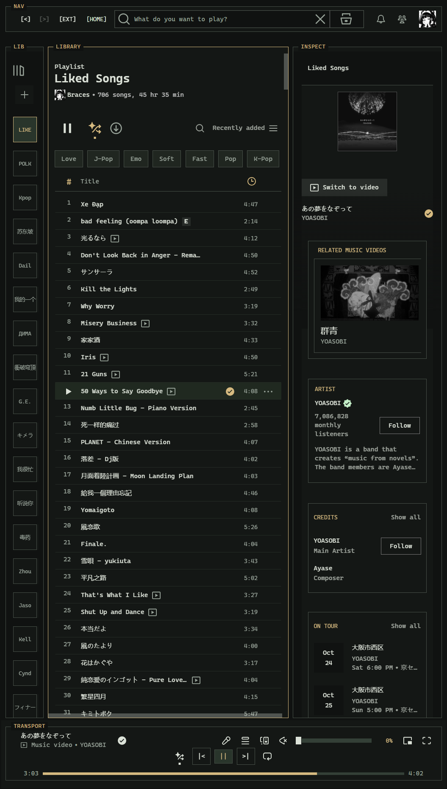

# Terminal for Spicetify

A terminal-inspired Spotify theme with square panels, monospace text, a muted
charcoal palette, and amber highlights. Built and checked on the Windows desktop
client.



## Features

- Framed NAV, LIB, main view, INSPECT, and TRANSPORT panels.
- Aligned `[EXT]`, `[HOME]`, and history controls.
- Compact track rows and monochrome artwork.
- Short library labels with Spotify's native hover labels.
- A 144-pixel volume slider, 28-pixel drag target, visible handle, and live percentage.
- Hidden native window buttons and menu dots. **F8** shows or hides them, with
  space reserved in the navigation when visible.
- Spotify's native navigation, playback, seeking, and playlist actions.

## Install on Windows

Install [Spicetify](https://spicetify.app/) first. Then run these commands in
PowerShell from the folder where you want to keep the repository:

```powershell
git clone https://github.com/braces157/spicetify-terminal.git
$themeRoot = Join-Path (spicetify config-dir) 'Themes'
New-Item -ItemType Directory -Path $themeRoot -Force | Out-Null
Copy-Item -LiteralPath '.\spicetify-terminal\Terminal' -Destination $themeRoot -Recurse -Force
spicetify config current_theme Terminal color_scheme Terminal inject_css 1 inject_theme_js 1 replace_colors 1
spicetify apply
```

The repository is private, so cloning requires a GitHub account with access.
You can also download its ZIP and copy the `Terminal` folder into the `Themes`
folder inside the directory printed by `spicetify config-dir`.

If a Marketplace theme is already active, deselect it in Marketplace before
applying Terminal so its injected CSS does not override this theme.

For dense playlist rows, choose **Compact** in Spotify's playlist view menu.
List view is also supported.

## Customize and update

Edit the installed `Terminal/color.ini` and the `--tui-*` variables in
`Terminal/user.css`, then run `spicetify refresh`. The theme uses Cascadia Mono,
Consolas, and system fallback fonts; it downloads no external fonts or images.

To update from this repository, run `git pull` inside the cloned repository,
copy its `Terminal` folder to your Spicetify `Themes` folder again, and run
`spicetify refresh`.

## Compatibility

Validated with **Spotify 1.3.3.264** and **Spicetify 2.45.3** on Windows.
Layout checks passed at viewport widths of 800, 844, and 1100 pixels. The native
volume drag behavior and both directions of the F8 toggle were verified.

Spotify updates can change selectors and internal APIs. Most structural rules
use semantic roles, test IDs, and theme-owned presentation attributes; some
artwork selectors target the tested client version.

Native titlebar hiding uses `NativeAPI` and `ControlMessageAPI` when available.
It keeps the selected visibility when Spotify changes panels or viewport zoom,
and restores the original API methods when the theme script is cleaned up.
Platforms without these APIs retain their native window controls. Other
platforms have not been tested.

## Credits

The terminal direction was inspired by
[NephVx2/Spicetify-tui](https://github.com/NephVx2/Spicetify-tui).
The native titlebar API approach was informed by
[No Controls](https://github.com/ohitstom/spicetify-extensions/tree/main/noControls).
